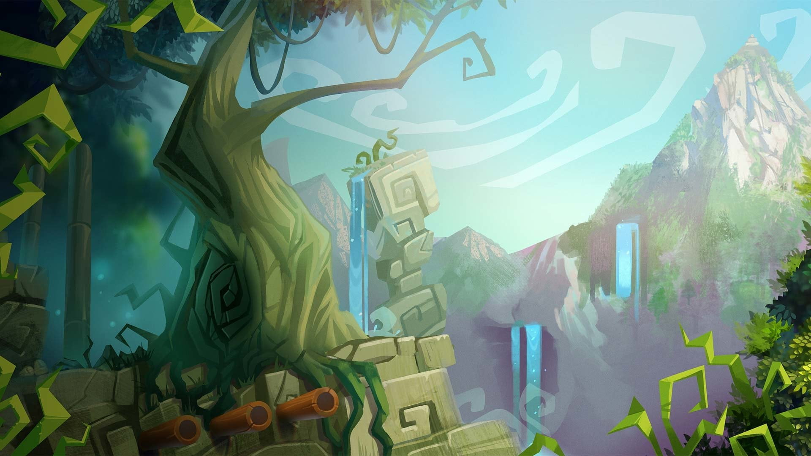

# Snake-Game
# 🐍 Snake Game

A classic Snake Game built using **HTML, CSS, and JavaScript** with sound effects, score tracking, high score storage, and an attractive game interface.

## 🎮 Live Demo

🔗 Play Here: https://prabal-pratik-singh.github.io/Snake-Game/

---

## 📸 Preview



---

## ✨ Features

- Classic Snake Gameplay
- Real-time Score Tracking
- High Score Saved using Local Storage
- Sound Effects
- Background Music
- Responsive UI
- Smooth Animations
- Pause / Resume Support

---

## 🛠️ Technologies Used

- HTML5
- CSS3
- JavaScript (ES6)
- Local Storage API

---

## 🎯 Controls

| Key | Action |
|------|---------|
| ↑ | Move Up |
| ↓ | Move Down |
| ← | Move Left |
| → | Move Right |
| Space | Pause / Resume |

---

## 📂 Project Structure

```text
Snake-Game/
│
├── index.html
├── style.css
├── peakpx.jpg
│
├── food.mp3
├── move.mp3
├── gameover.mp3
├── music.mp3
│
├── js/
│   └── index.js
│
└── README.md